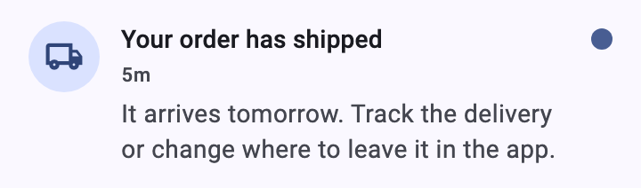
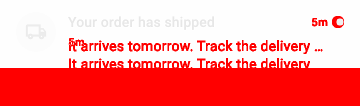

# shutter

[](https://pub.dev/packages/shutter)
[](https://github.com/koji-1009/shutter/blob/main/LICENSE)
[](https://github.com/koji-1009/shutter/actions/workflows/analyze.yml)
[](https://codecov.io/gh/koji-1009/shutter)

Shutter expresses a change to a Flutter widget as an image: it renders the widget to PNG before and after the edit, pairs the two, and marks the pixels that differ.
The subjects are the `@Preview` functions the project already has; a widget without one gets a small preview file that imports it.
Rendering happens in `flutter test`, without launching the app, and the preview file stays in the project, for the Flutter Widget Previewer and for every later shot.

| before                                                              | after                                                             | `diff --images`                                                   |
| ------------------------------------------------------------------- | ----------------------------------------------------------------- | ----------------------------------------------------------------- |
|  |  |  |

## When to reach for it

* A change going up for review: the images show what moved, which a description of it cannot.
* A refactor that should change nothing on screen: `diff` calls every shot `unchanged`, or names the ones that changed.
* A widget that might break on screen: an overflow, a `build` that throws, or an image that fails to load comes back as an `error` shot, with `at` naming the `lib/` line behind it.
* A dependency you just added or upgraded: shoot the screens that use it before and after, and the diff names the ones its defaults changed.

> **AI agents — start here:** run `shutter agent` before driving the tool. It is the step-by-step playbook: choosing the previews to shoot, shooting before and after, and reading the diff. `shutter manual` is the reference. Both ship in the binary, so `dart install shutter` is enough.

## What it does

A visual change is closed by an image, not by "it compiles" or "the tests pass". Shutter gives that image without launching the app and without writing a test:

* `shutter shot <preview-file>...` renders the widgets of the named preview files to PNG. A preview file imports any widget of the app and returns it from a function annotated with Flutter's `@Preview`; the widget itself needs no annotation.
* `shutter diff <run-a> <run-b>` classifies each shot of two runs as `changed`, `added`, `removed`, or `unchanged`, and points at its before and after images (`--images` adds an image marking the differing pixels).
* `shutter shot --widget '<expression>'` renders one widget out of the files it `--import`s, for a quick look without writing a preview file.

Each command does one thing and prints paths, so it composes with `grep`, `git`, `gh`, and whatever opens images.
Shutter makes no judgement: it does not decide what to shoot, whether a change is good, or where to post.
It keeps no golden images and knows nothing about git; every comparison is between two runs you made.

## Install

```bash
dart install shutter
```

The target project needs Flutter 3.47+ (Dart 3.13+) and `flutter_test` in `dev_dependencies`. It gains no dependency on shutter.
Shutter finds the Flutter SDK through `FLUTTER_ROOT`, or through `flutter` on `PATH` (a version manager's shim included).

### Agent skill

The package ships an [agent skill](https://dart.dev/tools/pub/package-skills), `shutter-visual-check`, telling an AI agent to reach for shutter when a change affects how a widget looks. It points at `shutter agent`, so the playbook always matches the installed binary.

```bash
dart run skills@ add koji-1009/shutter    # from the repository; the project gains no dependency
```

A project that lists shutter in `dev_dependencies` gets it with `dart run skills@ get` instead.

## Quick start

`shot` takes any file under `lib/` with `@Preview` functions, so previews the project already has are named as they are.
For a widget without one, write a preview file; the convention is the preview dir (`lib/preview/`, or `lib/src/preview/` in a package):

```dart
// lib/preview/notification_tile_preview.dart
import 'package:flutter/material.dart';
import 'package:flutter/widget_previews.dart';

import '../widgets/notification_tile.dart';

@Preview(name: 'NotificationTile', size: Size(360, double.infinity))
Widget notificationTile() => const Material(
  child: NotificationTile(
    icon: Icons.local_shipping_outlined,
    title: 'Your order has shipped',
    body: 'It arrives tomorrow. Track the delivery or change where to leave it in the app.',
    timestamp: '5m',
    unread: true,
  ),
);
```

`Size(360, double.infinity)` shoots the tile 360 wide at the height it takes in a list, and the `Material` paints the surface it sits on.

Shoot before the edit:

```console
$ shutter shot lib/preview/notification_tile_preview.dart
# shutter ai-report v1
run: /path/to/app/.dart_tool/shutter/runs/20260919T143503Z
shell: {path: lib/preview/shell.dart, sha256: 3bd0d8689642b359420876d859d4cfe94a404b7bdeb75ba237da990c310e936b}
summary: {error: 0, ok: 1}
shots:
  - id: "03a31f8f5d859fec.0"
    status: ok
    name: NotificationTile
    file: lib/preview/notification_tile_preview.dart:6
    size: [360, 68]
    png: /path/to/app/.dart_tool/shutter/runs/20260919T143503Z/03a31f8f5d859fec.0.png
```

Edit the widget, shoot again (here into run `20260919T143514Z`), and compare the two runs by their ids:

```console
$ shutter diff 20260919T143503Z 20260919T143514Z --images
# shutter ai-report v1
diff: /path/to/app/.dart_tool/shutter/diffs/20260919T143525Z
before: /path/to/app/.dart_tool/shutter/runs/20260919T143503Z
after: /path/to/app/.dart_tool/shutter/runs/20260919T143514Z
summary: {changed: 1, added: 0, removed: 0, unchanged: 0}
entries:
  - id: "03a31f8f5d859fec.0"
    status: changed
    name: NotificationTile
    file: lib/preview/notification_tile_preview.dart:6
    size: [360, 106]
    before_size: [360, 68]
    diff_ratio: 0.4158
    before: /path/to/app/.dart_tool/shutter/runs/20260919T143503Z/03a31f8f5d859fec.0.png
    after: /path/to/app/.dart_tool/shutter/runs/20260919T143514Z/03a31f8f5d859fec.0.png
    diff: /path/to/app/.dart_tool/shutter/diffs/20260919T143525Z/03a31f8f5d859fec.0.png
```

The three images are the ones at the top of this page.
A run can also be named `latest`, or `latest~N` for the run N before it, so `shutter diff latest~1 latest` compares the last two shots.
`diff` pairs the shots of two runs by id: the id comes from the preview's file and function, so the same preview has the same id in every run, and renaming or moving the function reports it as `removed` plus `added`.
The preview file stays in the project: the same function shows up in the Flutter Widget Previewer, and the next change is shot against it.

Every shot is wrapped in a shell: the project's `shell.dart` in the preview dir, with the app's own app widget, theme, router, and providers (`shutter init` writes one), or a default shell.
That shell is committed so everyone shoots with the same ambient; a shell not meant for the commit can live under `.dart_tool/` and be named with `--shell`.
Shutter itself depends on no design library, so Material, Cupertino, and custom widget sets all work.

A widget can also be shot straight out of the file it lives in, without a preview file:

```bash
shutter shot --widget 'PrimaryButton(label: "OK")' --import lib/ui/button.dart --size 200x56
```

`--import` names a file under `lib/`, or a `package:` URI of a dependency, that the widget expression needs imported (repeatable; `package:flutter/widgets.dart` is always imported).
The same `--widget` and `--import` give the same shot id, so two such runs line up in `diff`.

## Subcommands

| Command        | Purpose                                                                                                                    |
| -------------- | -------------------------------------------------------------------------------------------------------------------------- |
| `agent`        | The step-by-step playbook for AI agents.                                                                                   |
| `manual`       | The reference: preview files, drawing model, engine, runs, ids, diff, output, exit codes.                                  |
| `doctor`       | Check the Flutter SDK version, its font cache, and the project's shell (`--shell`).                                        |
| `init`         | Write `<preview dir>/shell.dart`, or the `--shell` file.                                                                   |
| `shot`         | Render the named preview files, or one `--widget`, into a new run (`--widget`/`--import`/`--size`, `--settle`, `--shell`). |
| `diff <a> <b>` | Compare two runs (`--images`).                                                                                             |

## Exit codes

| Command  | 0               | 1              | 2                |
| -------- | --------------- | -------------- | ---------------- |
| `shot`   | every shot ok   | —              | any shot `error` |
| `diff`   | no difference   | differences    | —                |
| `doctor` | no failed check | a failed check | —                |

`diff` exiting 1 means "changed", not "failed". Other failures follow sysexits: 64 usage, 66 missing run or file, 69 no Flutter SDK, 70 internal error, 78 project not usable.

## Limits

* One frame, no interaction: taps, hovers, scrolling, and mid-animation states are not shot. State comes from the widget's construction expression.
* HTTP is blocked while rendering, so network images fail to load.
* Text renders with the project's fonts plus Roboto; CJK and emoji fall back to the host's system fonts, and Cupertino text uses SF Pro on macOS (Roboto elsewhere), as a device would. Compare runs made on the same machine.

## Experimental

Behaviour whose specification is not settled; a later version may change what it does:

* The default shell for shots without a project shell: the SDK's `MaterialApp` with a `Material` surface, `material_ui`'s or `cupertino_ui`'s app widget when the project depends on that package, or a plain `WidgetsApp` when no design library is available. It changes when the SDK's Material and Cupertino, announced for deprecation, go.
* A preview's `theme`: applied through `PreviewThemeData`, an interface Flutter documents as not stable.
* [google_fonts](https://pub.dev/packages/google_fonts): fonts are downloaded once into `.dart_tool/shutter/fonts/google_fonts/` and served to the shot; a font that cannot be downloaded makes the shot an error instead of rendering in another font. Failures are recognised from the package's own messages, which change between its versions.

Details live in [`doc/manual.md`](doc/manual.md) (`shutter manual`).
